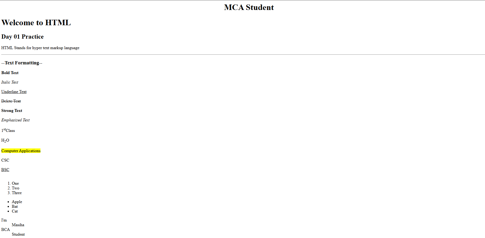

# Day 01 - HTML Basics

## Overview
Started learning HTML fundamentals and created my first simple webpage by understanding the basic structure of a webpage.

## Topics Covered
- HTML Document Structure
- Basic HTML Elements
- Headings and Paragraphs
- Text Formatting Tags

## Technologies Used
- HTML5

## Practice
Created a simple webpage using HTML elements and practiced building the basic structure of a webpage.

## Output

