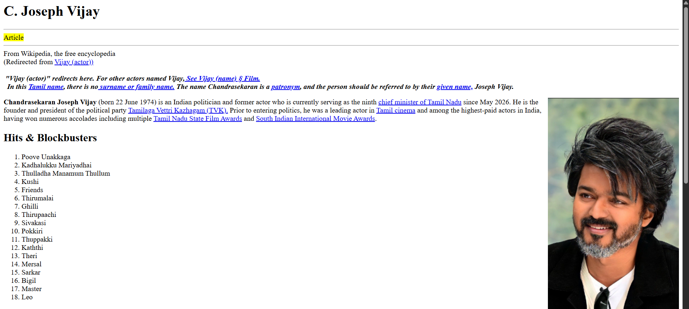
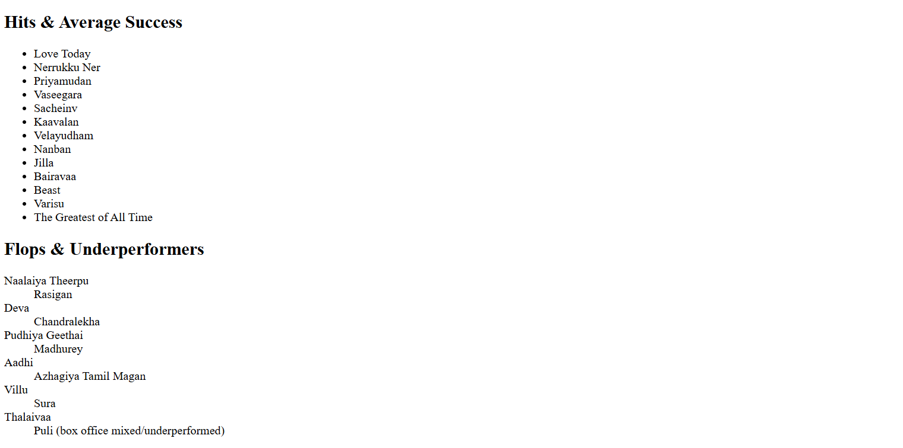

# Day 02 - Wikipedia Style Webpage

## Overview
Created a Wikipedia-style webpage using HTML to practice page structure and commonly used HTML elements.

## Topics Covered
- HTML Document Structure
- Headings
- Paragraphs
- Hyperlinks
- Images
- Ordered List
- Unordered List
- Description List
- Text Formatting
- Horizontal Rule

## Technologies Used
- HTML5

## Practice
Built a Wikipedia-style webpage by organizing content using HTML elements such as headings, links, images, and different types of lists.

## Output

### Output 1

### Output 2

