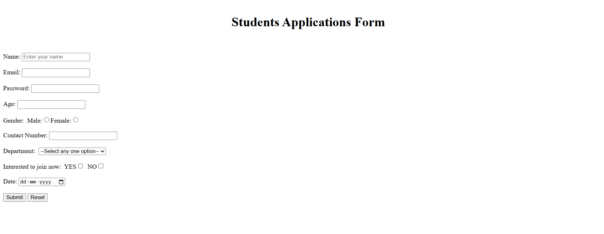

# Day 03 - Student Application Form

## Overview
Created a Student Application Form using HTML to practice different form elements and user input controls.

## Topics Covered
- HTML Forms
- Input Fields
- Labels
- Placeholder
- Radio Buttons
- Checkboxes
- Dropdown List (Select)
- Date Input
- Submit and Reset Buttons

## Technologies Used
- HTML5

## Practice
Built a Student Application Form by using various HTML form elements such as text fields, email, password, number input, radio buttons, checkboxes, dropdown menu, date picker, and form action buttons.

## Output

