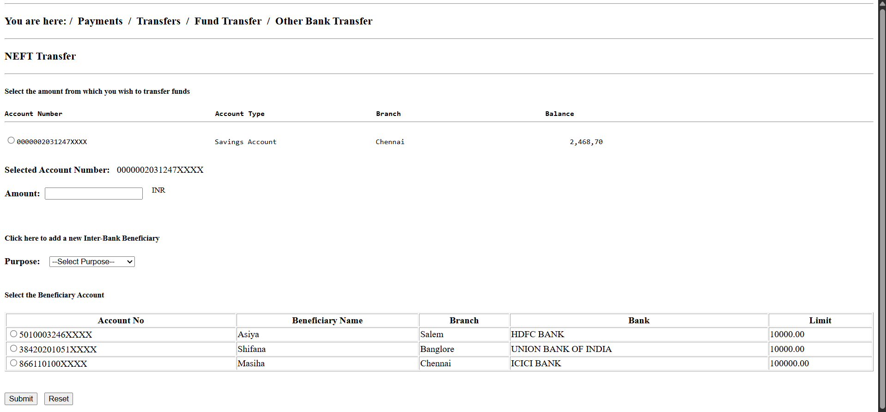

# Day 04 - Bank Application Form

## Overview
Created a Bank Application Form using HTML to practice form elements, tables, and user input controls.

## Topics Covered
- HTML Forms
- Tables
- Input Fields
- Radio Buttons
- Labels
- Dropdown List (Select)
- Number Input
- Submit and Reset Buttons
- Table Rows and Columns

## Technologies Used
- HTML5

## Practice
Built a Bank Application Form by combining HTML forms and tables to collect transfer details, account information, beneficiary details, and transaction purpose.

## Output

