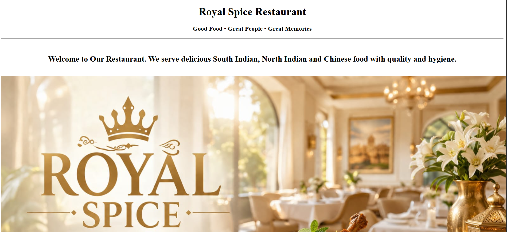
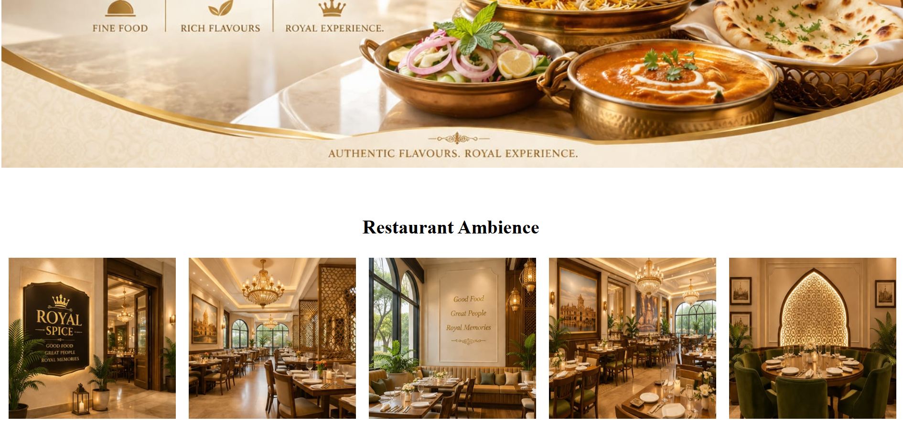
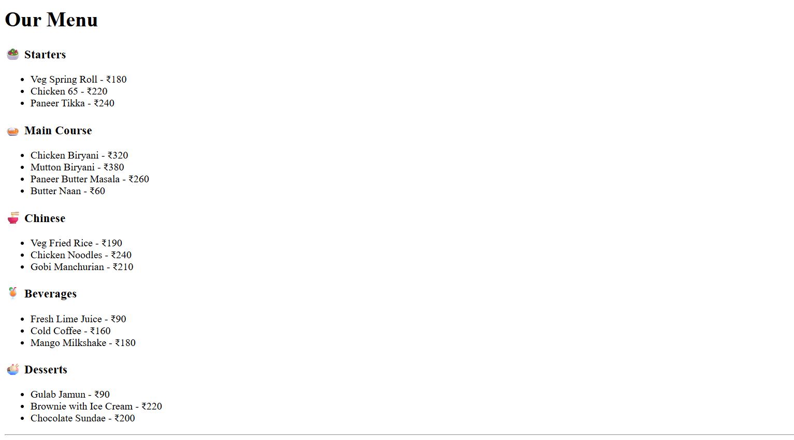
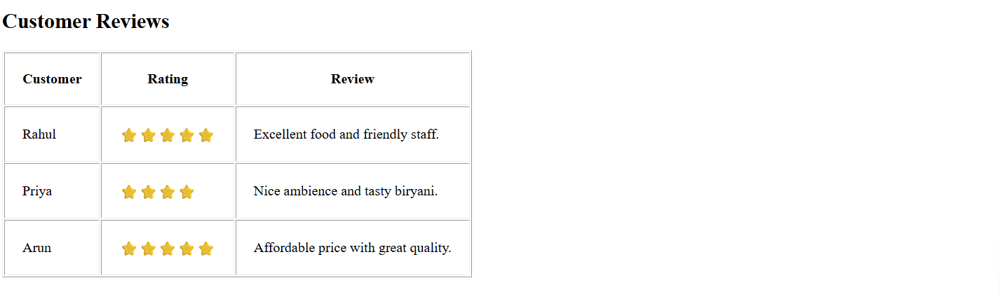
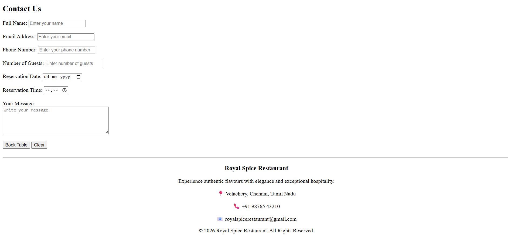

# Day 05 - Restaurant Website

## Overview
Created a Restaurant Website using HTML to practice building a complete webpage with images, tables, lists, forms, and different webpage sections.

## Topics Covered
- HTML Document Structure
- Headers and Footers
- Images
- Tables
- Ordered and Unordered Lists
- Forms
- Input Fields
- Textarea
- Submit and Reset Buttons
- Text Formatting

## Technologies Used
- HTML5

## Practice
Built a Restaurant Website featuring a welcome section, restaurant ambience gallery, food menu, customer reviews, contact form, and footer using HTML elements.

## Output

### Output 1

### Output 2

### Output 3

### Output 4

### Output 5

