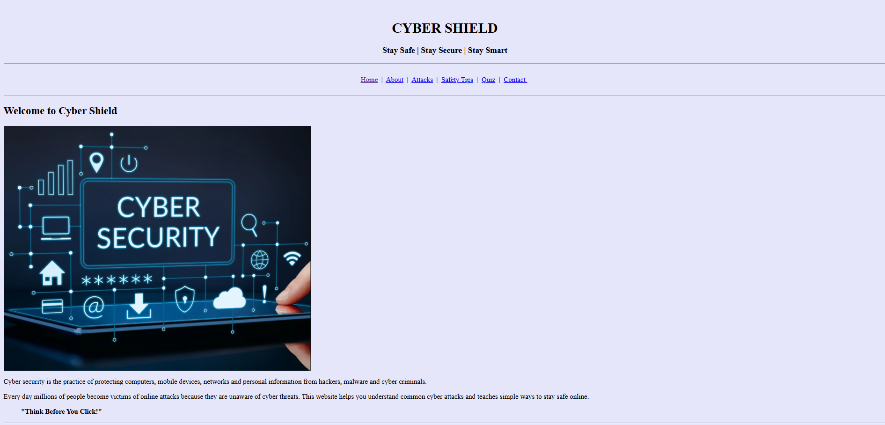
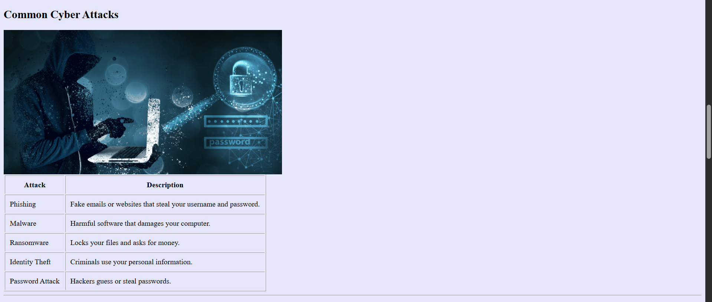
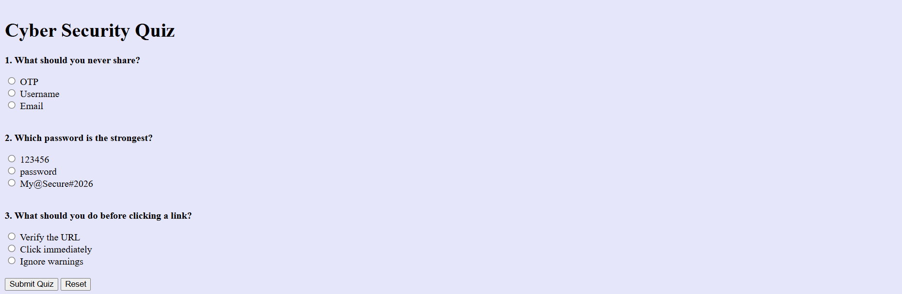
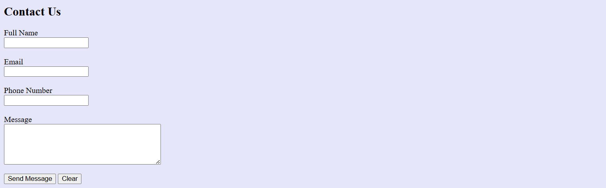
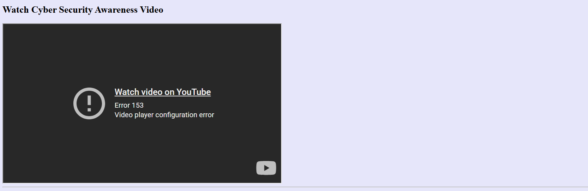
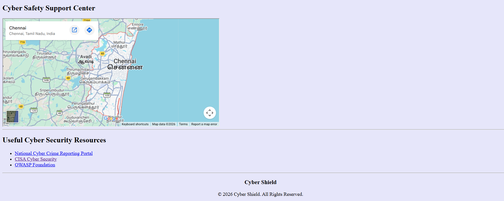

# Day 06 - Cyber Shield Website

## Overview
Built a multi-section Cyber Security awareness website using HTML. This project focuses on creating a structured webpage with navigation, images, tables, forms, embedded media, and external resources.

## Topics Covered
- HTML Document Structure
- Semantic HTML Elements
- Navigation Bar
- Headings and Paragraphs
- Images
- Lists (Ordered & Unordered)
- Tables
- Forms
- Internal Page Navigation
- Hyperlinks
- Embedded YouTube Video
- Embedded Google Maps
- Footer Section

## Technologies Used
- HTML5

## Practice
Created a Cyber Security awareness website featuring information about cyber security, common cyber attacks, safety tips, an awareness quiz, contact form, embedded YouTube video, Google Maps, and useful cyber security resource links.

## Output

